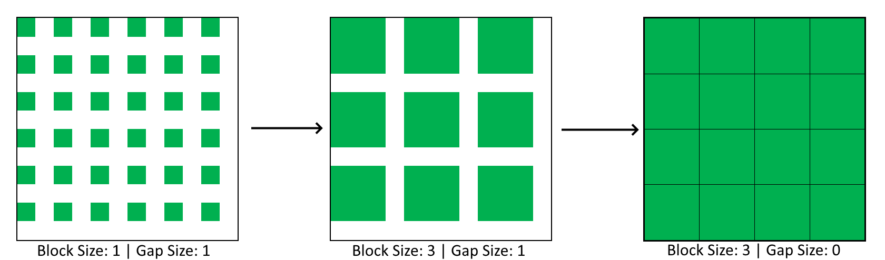

# Area

The ``Area`` object is a powerful object to get access to specific regions on the map. 
This page will try to explain a bit on how to use it and what the possibilities are.

First of all, the `Area` object uses "Method Chaining". 
This means that methods inside the `Area` object return the `Area` object itself.
This allows you to call another method straight after the first: 

```py
obj.x()
obj.y()
obj.z()
# With method chaining you can do:
obj.x().y().z()
```

This is perfect for a highly configurable and flexible objects like the `Area` object.

---

## Why would I use the `Area` object?

If you want to do anything with more than a single coordinate, it's quite the hassle sometimes.
That's the problem this object is _trying_ (feature suggestions always welcome!) to solve.

!!! Note
    The `Area` object strength comes from selecting specific pattern/tiles. If you want to do a similar thing with 
    every tile on the map this object won't help you much. 

---

## Examples

Below are a couple examples that show why this object can be very useful when working with coordinates.

### Creating a stack of units

Let's say you want to place 16 units, in a 4x4 area on the map. 
This is not necessarily difficult to do, it'd probably look something like the following:

```py
for x in range(10, 14):
    for y in range(50, 54):
        unit_manager.add_unit(
            player=PlayerId.ONE, 
            unit_const=UnitInfo.KNIGHT.ID, 
            x=x+.5, 
            y=y+.5
        )
```

This would create 16 units in a 4x4 area and isn't too bad to read or write. 
BUT, it feels a bit unnecessary, defining variables for your area just to place some units...
Let's see how we'd do it with the `Area` object.

```py
area = scenario.new.area()  # Create a new area object

# Select the area and convert it to a set of all coordinates inside of it
for tile in area.select(10, 50, 13, 53).to_coords():
    # Every tile is a NamedTuple with an 'x' and 'y' value
    unit_manager.add_unit(
        player=PlayerId.ONE, 
        unit_const=UnitInfo.KNIGHT.ID, 
        x=tile.x + .5, 
        y=tile.y + .5
    )
```

Above we can see the creation of a new `Area` object through the new Object Factory inside a scenario.
We use the `select` method to select our area. 

!!! Note
    Keep in mind that `Area.select` uses an inclusive selection. 
    This means that doing: `area.select(1, 1, 3, 3)` will select a 3x3 area.

---

### Castle surrounded by walls

Now, the above example was quite a simple one. The real power comes with the configuration!
So let's take a more complicated example! Like creating a wall around a castle!
This will be quite the difference, so let's do it in steps, first we create the castle and the area object.

```py
castle = unit_manager.add_unit(player=PlayerId.ONE, unit_const=BuildingInfo.CASTLE.ID, x=30, y=30)
area = scenario.new.area()
```

Now let's select the area of the castle itself, so the 4x4 area.

```py
area.center(castle.x, castle.y).size(4)
# Or using separate width and height calls:
area.center(castle.x, castle.y).width(4).height(4)
```

This sets the center of the area to the castles coordinates. 
After that we change the size of the selection from the default (1x1) to (4x4).
We now have the castle area selected. Let's say we want the wall 6 tiles around the castle.
Let's expand our selection by 6 tiles.

```py
# On it's own line
area.expand_by(6)
# Or add it to the above line
area.center(castle_object.x, castle_object.y).size(4).expand_by(6)
```

Now we have a 16 by 16 tile area selected.
The 4x4 from the castle plus the 6 tiles we expanded to all four sides.

We _could_ do the same thing as above with the knights in the 4x4 but there's a problem.
The selection covers all those 256 (16*16) tiles. So we'd be filling everything with walls. 
We just want the edges so, let's do that. For that we use a so called "use" function.

```py
# On it's own line
area.use_only_edge()
# Or, again, add it to the above line
area.center(castle_object.x, castle_object.y).size(4).expand_by(6).use_only_edge()
```

This tells the area object we only want the outer edge of the selection.
Now let's convert that to coordinates and place those walls! We can use `area.to_coords()` again!

```py
castle = unit_manager.add_unit(player=PlayerId.ONE, unit_const=BuildingInfo.CASTLE.ID, x=30, y=30)
area = scenario.new.area()

for tile in area.center(castle.x, castle.y).size(4).expand_by(6).use_only_edge().to_coords():
    unit_manager.add_unit(
        player=PlayerId.ONE, unit_const=BuildingInfo.STONE_WALL.ID, x=tile.x, y=tile.y
    )
```

And that's it! The castle has walls around it. With such ease!


---

### Checkers pattern

So, let's say we want to create a checkers pattern. 
Where we create squares of ice and black terrain alternately.
To do this we basically need all tiles on the map but in separate squares.
So selecting the entire map won't help here as we want them all separated.

So, what we want is blocks of 3x3 over the course of the map. 
The map we're reading is a tiny 2 player map which has a size of 120 by 120 tiles.

There's many ways to go about this, so this is just one solution.
We're going to be using two 'layers' of `Area` objects by (sort of) 'nesting' them. 
So, my plan is, use the grid function in the `Area` object to get the coordinates of where each area should go.
Then use those to create more `Area` objects which will expand their selection to match the 3x3.


So to explain the image above, these 3 squares represent the map, instead of 120 by 120 tiles it's 12 by 12 to make it 
easier to visualize.
First we select tiles in a grid (first square). We'll use a distance between tiles of 2. 
Then we'll create `Area` objects per tile. This way we can easily modify each 3x3 square separately.
After that we'll expand the selections of all `Area` objects by 2 in the x2 and y2 direction (square 2).
Finally, we can use the 3x3 `Area` objects to get the terrain tiles and change their terrain.

Alright, first, let's create the main `Area` object and select the entire map. 

```py
area = scenario.new.area()
area.select_entire_map()
```

After that, let's set it so that it uses the grid pattern

```py
area.select_entire_map().use_pattern_grid()
```

Now this would be default return a grid with gaps of 1 and blocks of 1x1. Which would look like this:



We want blocks of 1x1 but a gap of 2. So let's add a configuration to the function, we can do this in four ways, choose 
the one you like the most (We continue with the first option):

```py
# For the third option:
from AoE2ScenarioParser.objects.support.area import AreaAttr

...use_pattern_grid(line_gap=2)
...use_pattern_grid().attr('line_gap', 2)
...use_pattern_grid().attr(AreaAttr.LINE_GAP, 2)
...use_pattern_grid().attrs(line_gap=2)
```

!!! Tip "You can differentiate the X and Y"
    In many functions you can use the general option like `line_gap`. 
    But there's also options for `line_gap_x` and `line_gap_y` if you want different selections.

Now that we have the grid, let's create area objects for each grid tile. 

```py
squares = []
for tile in area.to_coords():
    squares.append(scenario.new.area().select(tile.x, tile.y))
```

Now each tile from the grid (earlier first square) has its own Area object that has selected a 1x1 area.
We can also expand that selection by 2 to the x2 and y2 sides. Let's add it into the loop:

```py
squares = []
for tile in area.to_coords():
    squares.append(
        scenario.new.area().select(tile.x, tile.y).expand_x2_by(2).expand_y2_by(2)
    )
```

Now let's add the final piece where we change the terrain itself. We can use a function called `to_terrain_tiles()` to
directly retrieve the tiles themselves. This way we can, for example, immediately edit the terrain ids.

```py
for index, square in enumerate(squares):
    for terrain_tile in square.to_terrain_tiles():
        terrain_tile.terrain_id = TerrainId.BLACK if index % 2 == 0 else TerrainId.ICE
```

So the code above loops through all the 3x3 squares. 
Then for each square it loops through all the terrain tiles retrieved using `area.to_terrain_tiles()`.
We then set the terrain to `BLACK` or `ICE` depending on the index reduced by modulo 2.
This will alternate the tiles between the two terrain types.

There's one small adjustment we need to make. Because the map 120 tiles and the squares have a length of 3 we can fit
40 squares per row. This is an even number. So just alternating `BLACK` and `ICE` terrain based on index will cause
it to create lines instead of alternating each row. We can fix this by adding the row with the index and reduce that
by modulo 2 to get our ideal situation. 

```py
for index, square in enumerate(squares):
    row = index // squares_per_row
    for terrain_tile in square.to_terrain_tiles():
        terrain_tile.terrain_id = TerrainId.BLACK if (index + row) % 2 == 0 else TerrainId.ICE
```

Another way to get around this is make sure the squares fit an odd amount of times in the length of the map. 
So using the earlier loop, without the row, with a map size of 117 (39 times) would result in the same pattern as the 
code above.


