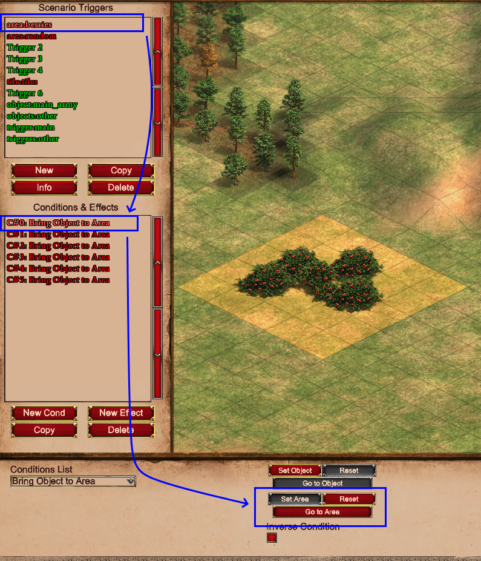
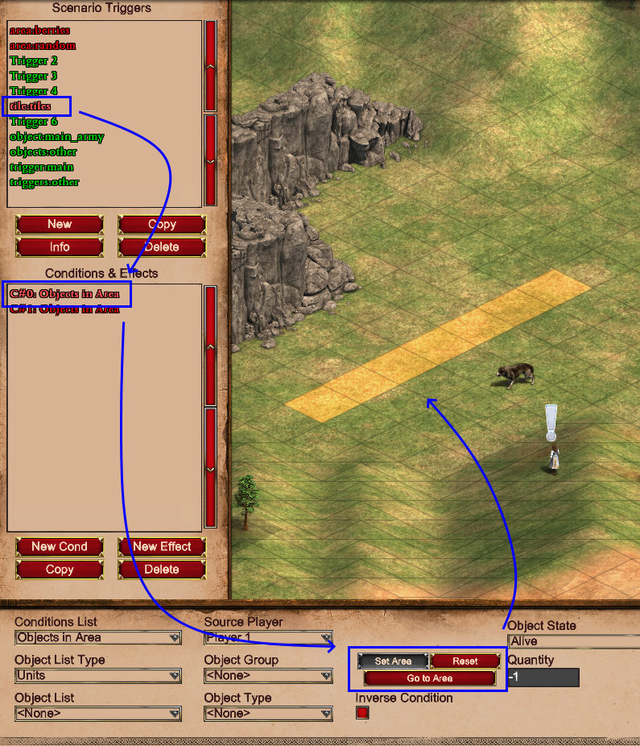
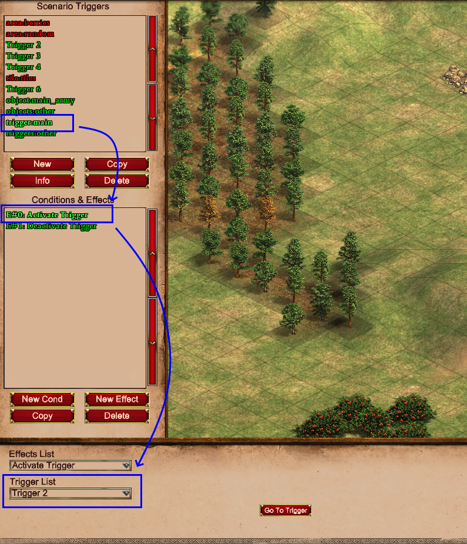

# Data Triggers

**Data Triggers** is a new feature to the parser. 
They allow you to transfer the power of visuals from the in-game editor into the parser!

## What are these data triggers?

Data triggers are basically triggers with specifically set names.  
The triggers also have some effects and conditions which selects stuff like: areas, units, triggers or tiles.

## Why do I need them?

If you ever wanted to do something with an area or specific objects or triggers that are already present in the
scenario before reading with the parser, you'd need to select them through their coordinates or names etc. This can be a
bit of a challenge or annoying to keep doing over and over at best.

So, that's what data triggers are for. You use conditions and effects to select those aspects of the map and in the 
parser you can use a simple, single line of code to get all this data easily accessible to you.

## Creating the data triggers

So, how do we create the data triggers? Well, like so:

1. Open your scenario in-game
2. Create a trigger
3. Change the name of the trigger to "_area:cool_middle_area_"
4. Create a `Bring Object to Area` conditions. (It doesn't matter which condition or effect you choose. As long as an area can be selected with it)
5. Use the `Set Area` button to select an area on the map
6. Save the scenario
7. Use the parser to load the map
8. Use the code below to get the area object:

```py
scenario = ... # Load scenario stuff here

trigger_data = scenario.actions.load_data_triggers()
cool_area = trigger_data.areas['cool_middle_area']
```

And that's it! Now you have a list of `Area` objects which contains all the areas that you selected in the trigger!
You can add more effects/conditions with areas to that trigger, and they'll be added to the list. 
You can also create another trigger with the same `area:<name>` name and add more effects or conditions to it to create 
different selections.

!!! Note "The data triggers are automatically removed"
    The function `.load_data_triggers()` automatically removes all triggers it finds with the proper prefix. If you'd
    like to keep these triggers you can use the `remove_template_triggers` parameter and set it to `False`.

## Different data types

Currently, there's 4 data types you can use to select information on the map. These are:

### Area

Create an `Area` object based on an area selected using the `Set Area` button in-game (Effects & Conditions).

### Tile

Create `Tile` objects based on a single tile selected using the `Set Location` button (Effects)
or a bunch of tiles selected using the `Set Area` button (Effects and Conditions) in-game.

### Object

Select a `Unit` object (or multiple `Unit` objects) based on the selected units using the `Set objects` button
(Effects and Conditions) or `Set location` button (Effects) (Works with both selecting a unit AND the tile a unit is 
standing on). It also allows selecting an area using the `Set Area` button (Effects and Conditions) and all units
within that area will be included.

### Trigger

Select a `Trigger` object based on the selected trigger in (de)activation effects using the `Trigger List` dropdown.

## Mechanics

The `load_data_triggers()` function looks for a specific prefix in the trigger names. The prefixes are as follows:

| Type      | Prefixes                    |
| --------- | --------------------------- |
| `Area`    | "_area:_", "_areas:_"       |
| `Tile`    | "_tile:_", "_tiles:_"       |
| `Object`  | "_object:_", "_objects:_"   |
| `Trigger` | "_trigger:_", "_triggers:_" |

When it finds a prefix it uses the name after the colon to store the objects in a dictionary, so these _should_ be 
unique per data type.

The function then goes through all the effects and conditions within the trigger. The effect or condition type doesn't 
matter. The function just checks the proper attributes (for example: the `area_x1`, `area_y1`, `area_x2` & `area_y2` 
attributes) for the area data type. If all of those attributes are set, it creates/finds the proper object accordingly.

The object returned by `load_data_triggers()` has 4 attributes which will return the corresponding dictionaries.
So, for example, you could store the dicts directly like so:

```py
from typing import List

from AoE2ScenarioParser.helper.attr_dict import AttrDict

from AoE2ScenarioParser.objects.data_objects.trigger import Trigger
from AoE2ScenarioParser.objects.data_objects.unit import Unit
from AoE2ScenarioParser.objects.support.area import Area
from AoE2ScenarioParser.objects.support.tile import Tile

scenario = ... # Load scenario stuff here

trigger_data = scenario.actions.load_data_triggers()

# You could leave out the 'AttrDict[...]' parts (and the corresponding imports). 
# That being said, they do help your IDE understand the proper types for type hinting later on
areas: AttrDict[str, List[Area]] = trigger_data.areas
tiles: AttrDict[str, List[Tile]] = trigger_data.tiles
triggers: AttrDict[str, List[Trigger]] = trigger_data.triggers
objects: AttrDict[str, List[Unit]] = trigger_data.objects
```

The dictionaries are also special in that they allow attribute access instead of only key access.
So to get the key "_TCs_" you can use either of these with the same result: 

```py
trigger_data.objects['TCs']
trigger_data.objects.TCs
```

!!! Note "Keys with spaces won't work with attribute access"
    When your key has characters like spaces (or other special chars) you have to use: 
    ```py
    trigger_data.objects['name with space here']
    ```

## Examples

### Area

This trigger was made to make an area object around berries. (Don't ask why).
You can see multiple conditions in the list. 
All of them have an area selected so the list for the `berries` will have 6 `Area` objects



### Tile

This trigger just selects a bunch of tiles. As you can see in the image, tiles can also be selected by the `Set Area`
button. This will result in multiple `Tile` objects being created for one effect. The list for this trigger will return
at least the 7 `Tile` objects selected by this condition.



### Object

This trigger was made to easily select the 'main army' of a player.
The `Set Objects` button was used to select multiple units at once. 
As you can see multiple effects and conditions were used in this trigger. 
All of them have units selected through the `Set Objects` or `Set Location` buttons. 
This list will be longer than just 3 `Unit` objects as the shown effect already selects 3 units on its own. 
So, if the other 2 only selected 1 unit each, the list would have 5 `Unit` objects in total.


### Trigger

This trigger selects 2 triggers with the name 'main'. Data triggers for selecting triggers is the simplest as you can
only select 1 Trigger per effect. So this list will have 2 triggers in it.

