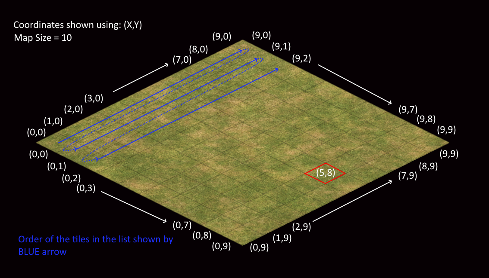
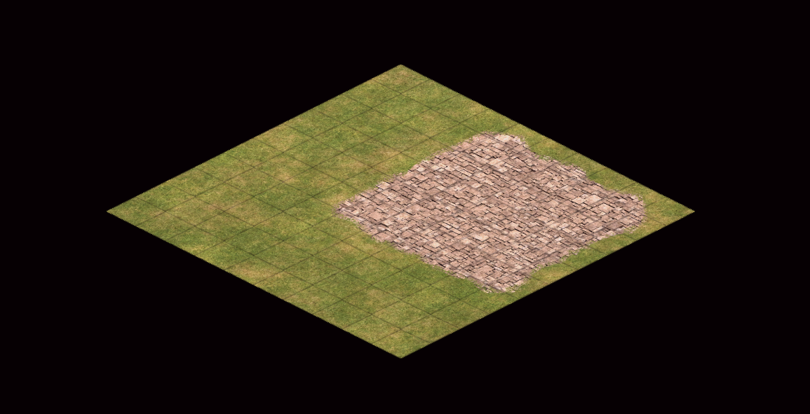

# Map

You can use the map manager to adjust the terrain, elevation, map size and other attributes.

## Map Size

You can adjust the map size using the parser. 

!!! warning "Only rectangular maps"
    The game only supports square maps. Changing the size to a rectangle that is not a square will cause the game to crash.

!!! warning "Maximum size is 480"
    The game does not support maps over the size of 480. Beyond this size the game will crash when you test the scenario.

You can adjust the map size like so:

```py
from AoE2ScenarioParser.scenarios.aoe2_de_scenario import AoE2DEScenario

# File & Folder setup
# Define paths to the scenario folder.
# You can find this folder by opening AoE2:DE and going to scenarios and clicking on 'open folder'
scenario_folder = "your/path/to/the/scenario/folder/"  # <-- Final slash is important
scenario_name = "name_of_your_scenario"

# Define Scenario file
scenario = AoE2DEScenario.from_file(f"{scenario_folder}{scenario_name}.aoe2scenario")

# Add Trigger
map_manager = scenario.map_manager
# Set it to a nice small 10x10 map :)
map_manager.map_size = 10

# Write to same folder with name + '_output'
scenario.write_to_file(f"{scenario_folder}{scenario_name}_output.aoe2scenario")
```

## Terrain

You can also edit terrain tiles.

### Terrain Tiles

Each terrain tile has 3 properties. It's `elevation`, `terrain_id` and `layer`.
You can request this information using: 

```py
tile = map_manager.get_tile(0, 0)
tile.terrain_id
tile.elevation
tile.layer
```

You can also edit this information, for example if you want to change tile 20 into water, you can:

```py
from AoE2ScenarioParser.datasets.terrains import TerrainId

tile = map_manager.get_tile(i=19)  # (0 based, 0 is the 1st tile, 1 is the second tile etc.)
tile.terrain_id = TerrainId.WATER_SHALLOW
```

You can also request `readonly` properties from a tile, like its index or coordinates.  
These **cannot** be edited.

```py
tile = map_manager.get_tile(0, 0)
tile.i      # 85  (Same tile as when you do: map_manager.terrain[85])
tile.x      # 5
tile.y      # 8
tile.xy     # (5, 8)  <-- Tuple(5,8)
```

### Selection

There's multiple ways to get access to the terrain tiles. The first thing you can do is get access to the entire terrain
list through:

```
map_manager.terrain  # Returns a one dimensional list of TerrainTile objects
```

The list is the map stacked in a single list. The first entry in the list is the most `West` tile in the scenario.
The second entry is the tile to the top right of the last one. The third is on the top right of that one. This continues
until you hit the North East edge. Then it'll continue with the tile to the bottom right of the first tile and the tile
after that is the tile to the top right of it. 

Below you can see a visualisation of a 10x10 map. The coords are `(X,Y)` coordinates and the blue line is the order in 
which tiles are saved.



To get a tile based on it's XY coordinate (like `(5,8)`, as highlighted in the above image) you can use:

```py
map_manager.get_tile(x=5, y=8)  # Get tile at x5,y8
map_manager.get_tile(i=85)      # Get the 86th tile (0 based, 0 is the 1st tile, 1 is the second tile etc.)
```

You can also get a square of tiles from the map. For this you can use the function `get_square_1d()` or 
`get_square_2d()`. Both the functions will return the same tiles, but one will result in a list of tiles, the other in a 
list of list with tiles.

For example, if you want to turn a square of tiles into roads:

```py
from AoE2ScenarioParser.datasets.terrains import TerrainId

# Using: get_square_1d
for tile in map_manager.get_square_1d(x1=4, y1=4, x2=8, y2=8):
    tile.terrain_id = TerrainId.ROAD

# Using: get_square_2d
for tile_row in map_manager.get_square_2d(x1=4, y1=4, x2=8, y2=8):
    for tile in tile_row:
        tile.terrain_id = TerrainId.ROAD
```

This will turn the above map into:



## Elevation

You can also add hills to the map by using the `set_elevation` function. 
In the below graphic you can see the coordinates used in the function. 


Thanks to [ScribbleGhost](https://github.com/ScribbleGhost) for the graphic! ❤️

```py
map_manager.set_elevation(
    elevation=1,
    x1=3, 
    y1=6, 
    x2=9, 
    y2=12,
)
```

!!! tip "Elevation is also zero based"
    Elevation is zero based, 0 represents what Age2 calls elevation 1, 1 represents elevation 2 etc.

This will create a hill of elevation **3** in the game. The top square of the hill will be 3x3 tiles. Because (3,3) to
(5,5) shown in the function above represents the top of the hill. The entire hill, including the slopes, will start on:
(1,1) to (7,7).

!!! warning "Don't go too high!"
    Using the parser you can basically go as high as you want, **BUT** above ~20 without UHD and ~15 with UHD the 
    camera starts clipping into the hill. 
