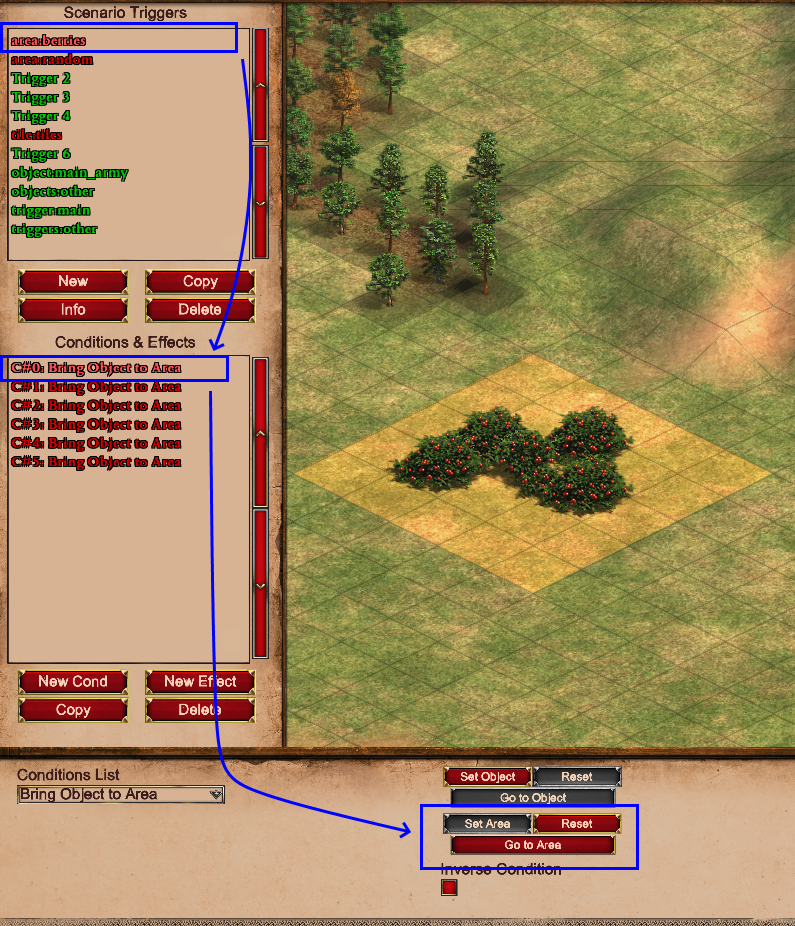
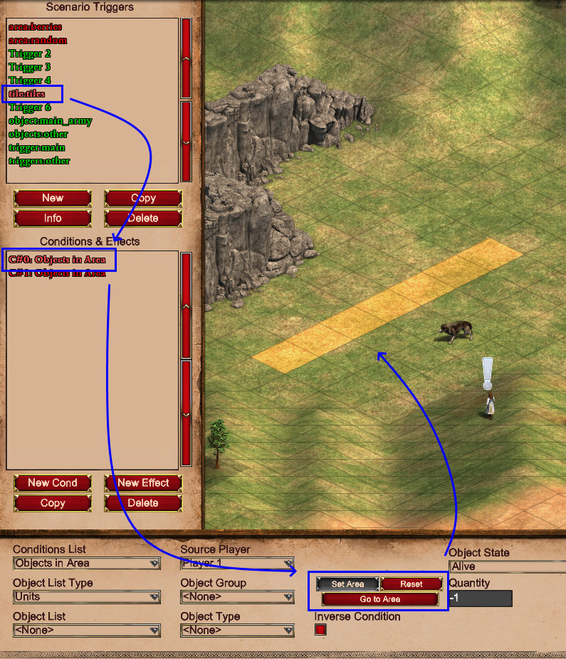
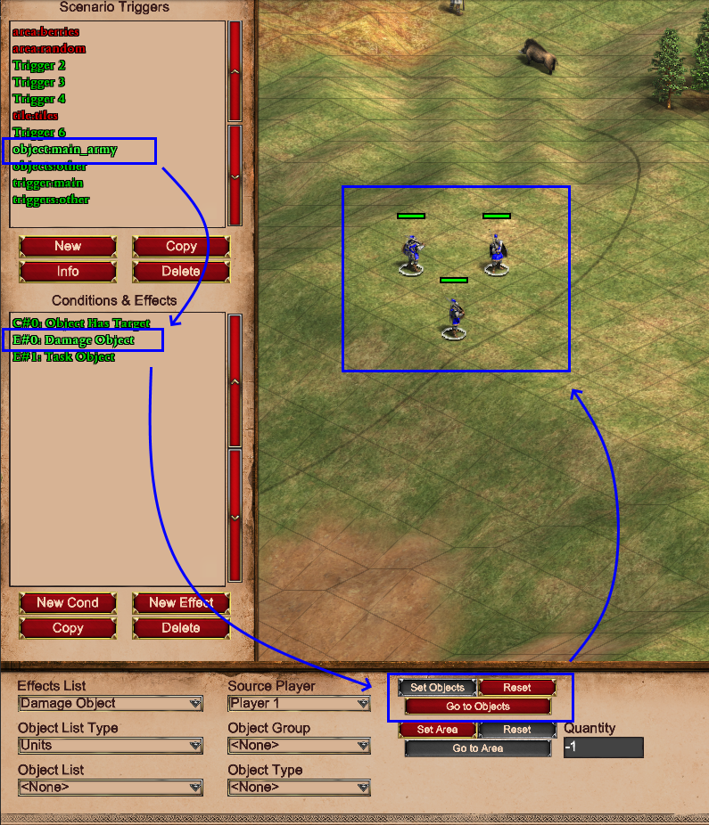
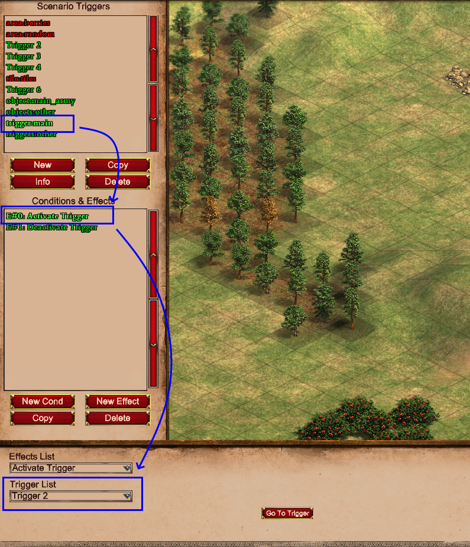

# Trigger Markings

**Trigger Markings** is a new feature to the parser. They allow you to transfer the power of visuals from the in-game
editor to the parser!

## What are these markings?

Markings are basically triggers with specific names with some effects and conditions which select certain areas, units
triggers or tiles.

## Why do I need them?

If you ever wanted to do something with an area or with specific objects or triggers that are already present in the
scenario before reading with the parser, you'd need to select them through their coordinates or names etc. This can be a
bit of a challenge or annoying to keep doing over and over at best.

So, that's what markings are for. You use conditions and effects to select those aspects of the map and in the parser
you can use a simple, single line of code to get all this data easily accessible to you.

## Creating the markings

So, how do we create the markings? Like so:

1. Open your scenario in-game
2. Create a trigger
3. Change the name of the trigger to "_area:cool area_"
4. Create a `Bring Object to Area` condition
5. Use the `Set Area` button to select an area on the map
6. Save the scenario
7. Use the parser to load the map
8. Use the code below to get the area object:

```py
from typing import List
from AoE2ScenarioParser.objects.support.area import Area

...  # Load scenario stuff here

markings = scenario.actions.discover_trigger_markings()
cool_area: List[Area] = markings.areas['cool area']
```

And that's it! Now you have a list of a single `Area` object!
You can add more effects/conditions to that trigger, and they'll be added to the list. You can also create another
trigger with the same `area:<name>` name and add more effects or conditions to it to create different selections.

!!! Note "The marking triggers are automatically removed"
    The function `.discover_trigger_markings()` automatically removes all triggers it finds with a marking prefix. If you'd
    like to keep these triggers you can use the `remove_template_triggers` parameter and set it to `False`.

## Different marking types

Currently, there's 4 marking types you can use to select information on the map. These are:

1. Area

   Create an `Area` object based on an area selected using the `Set Area` button in-game (Effects & Conditions).

2. Tile

   Create a `Tile` object based on a single or a bunch of tiles using the `Set Location` button (Effects)
   or `Set Area` button (Effects and Conditions) in-game.

3. Object

   Select a `Unit` object (or multiple `Unit` objects) based on the selected units using the `Set objects` button
   (Effects and Conditions) or `Set location` button (Effects).

4. Trigger

   Select a `Trigger` object based on the selected trigger in (de)activation effects using the `Trigger List` dropdown.

## Mechanics

The `discover_trigger_markings()` function looks for a specific prefix in the trigger names. The prefixes are as
follows:

| Type      | Prefixes                    |
| --------- | --------------------------- |
| `Area`    | "_area:_", "_areas:_"       |
| `Tile`    | "_tile:_", "_tiles:_"       |
| `Object`  | "_object:_", "_objects:_"   |
| `Trigger` | "_trigger:_", "_triggers:_" |

When it finds a prefix it uses the name after the colon to store the objects in a dictionary, so these _should_ be 
unique per marking type.

The function then goes through all the effects and conditions within the trigger. The effect or condition type doesn't 
matter. The function just checks the proper attributes (like the `area_x1`, `area_y1`, `area_x2` & `area_y2` attributes) 
for the area markings. If all of those attributes are set, it creates/finds the proper object accordingly.

The object returned by `discover_trigger_markings()` has 4 attributes which will return the corresponding dictionaries.
So, for example, you could store the dicts directly like so: 

```py
markings = scenario.actions.discover_trigger_markings()

areas: Dict[str, List[Area]] = markings.areas
tiles: Dict[str, List[Tile]] = markings.tiles
triggers: Dict[str, List[Trigger]] = markings.triggers
objects: Dict[str, List[Unit]] = markings.objects
```

The dictionaries are also special in that they allow attribute access instead of only key access.
So to get the key "_TCs_" you can use either of these with the same result: 

```py
markings.objects['TCs']
markings.objects.TCs
```

!!! Note "Keys with spaces won't work with attribute access"
    When your key has characters like spaces (or other special chars) you have to use: 
    ```py
    markings.objects['name with space here']
    ```

## Examples

### Area

This trigger was made to make an area object around berries. (Don't ask why).  
You can see multiple conditions in the list. 
All of them have an area selected so the list for the `berries` will have 6 `Area` objects



### Tile

This trigger just selects a bunch of tiles. As you can see in the image, tiles can also be selected by the `Set Area`
button. This will result in multiple `Tile` objects being created for one effect. The list for this trigger will return
at least the 7 `Tile` objects selected by this condition.



### Object

This trigger was made to easily select the 'main army' of a player.
The `Set Objects` button was used to select multiple units at once. 
As you can see multiple effects and conditions were used in this trigger. 
All have units selected through the `Set Objects` or `Set Location` buttons. 
This list will be longer than just 3 as the shown effect already selects 3 units on it's own. 
So, if the other 2 only selected 1 unit each, the list would have 5 `Unit` objects in total.



### Trigger

This trigger selects 2 triggers with the name 'main'. Trigger markings for selecting triggers is the simplest as you can
only select 1 Trigger per effect. So this list will have 2 triggers in it.

