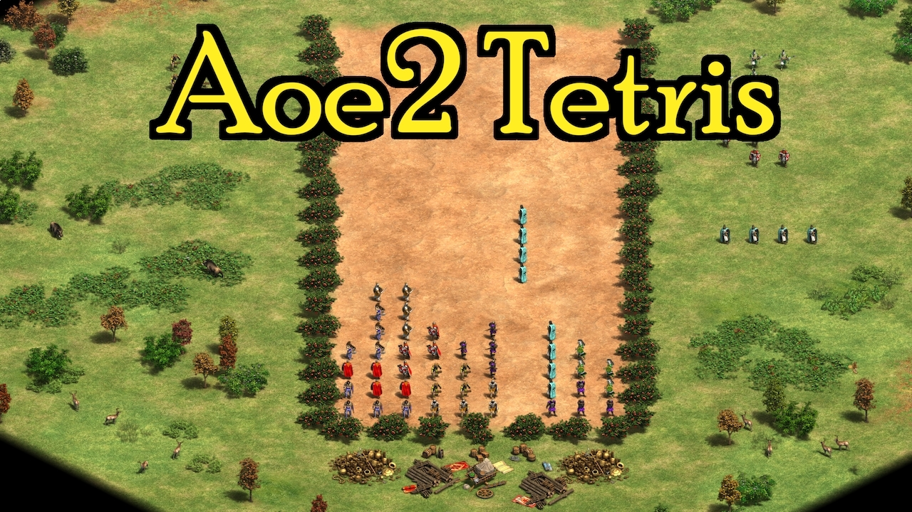

# Community Projects

Below is a list of projects made by the community. Go and take a look to get inspired by these amazing scenarios!

---

## Scenarios

---

**AoE2 Tetris**

An implementation of Tetris that is playable as an Age of Empires II:DE scenario.

Author: **T-West** (
[Youtube](https://www.youtube.com/c/TWestYT) /
[Twitch](https://www.twitch.tv/twestaoe) /
[GitHub](https://github.com/twestura)
)  
Resources:
[Github Repo](https://github.com/twestura/aoe2tetris) /
[Youtube Video](https://www.youtube.com/shorts/9ZMobR31qdE) /
[AoE2:DE Mod](https://www.ageofempires.com/mods/details/21466/)

---

**Perk Pandemonium AoE2DE**

Author: **Alian713** (
[GitHub](https://github.com/Divy1211)
)  
Resources:
[Github Repo](https://github.com/Divy1211/perk_pandemonium_aoe2de#perk-pandemonium-aoe2de) /
[AoE2:DE Mod](https://www.ageofempires.com/mods/details/19751/)
